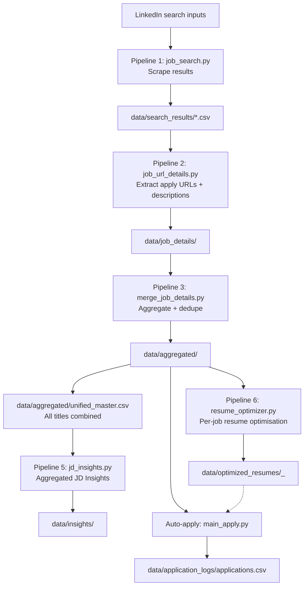

# Setup checklist

## 1) Prereqs (one-time)
- **Activate environment**: source venv/bin/activate
- **Install dependencies**: python -m pip install -r requirements.txt
- **Chrome/Chromium installed** (used by Selenium/undetected-chromedriver)

### LinkedIn cookies (required for scraping)
- Generate cookies (one-time or when expired)
  - Run: python3 src/job_extraction/manual_login.py
  - Writes: config/linkedin_cookies.txt

### Optional: LLM extraction
- Set OPENAI_API_KEY in your shell (used by JD variable extraction and analysis)

### Optional: Simplify autofill
- Use a persistent Chrome profile that has the Simplify extension installed
- Setup once:
  - Run: python3 src/auto_application/main_apply.py --csv_file "<path>" --setup_simplify_profile --chrome_user_data_dir "<profile_dir>" --keep_user_data_dir
- Find extension IDs:
  - Run: python3 src/auto_application/list_extensions.py --chrome_user_data_dir "<profile_dir>"

### Auto-apply user config (required for applying)
- Interactive setup:
  - Run: python3 src/auto_application/setup_config.py
- Config file created: config/user_config.json

### Optional: Quick prereq check
- Run: python3 src/auto_application/check_prereqs.py

---

## 2) End-to-end pipeline (recommended order)

### Step A: Job search + enrichment + merge + insights + resume optimization
- Run: ./scripts/run_get_jobs.sh
- This single command executes **6 pipelines** in sequence:
  1. **Pipeline 1 – Job Search**: Scrapes LinkedIn results → `data/search_results/`
  2. **Pipeline 2 – URL Details**: Extracts apply URLs + descriptions → `data/job_details/<title>/`
  3. **Pipeline 3 – Merge & Dedupe**: Aggregates + deduplicates → `data/aggregated/<title>/` + rebuilds the **unified master** (`data/aggregated/unified_master.csv`) combining all job titles
  4. **Pipeline 5 – Aggregated JD Insights**: Extracts keywords, skills, tools, phrases, topics from all new job descriptions. Maintains cumulative counts and category breakdowns → `data/insights/<title>/`
  5. **Pipeline 5.5 – Alignment Scoring**: Scores each job description against your resume + supplementary terms. Produces alignment grades (A+ through D), gap analysis, and detailed match reports → `data/alignment_scores/<title>/`
  6. **Pipeline 6 – Resume Optimization**: For each job with a description+URL, generates a tailored resume (reordered skills, optimised summary, reranked bullets). Uses OpenAI if OPENAI_API_KEY is set, otherwise keyword-match fallback → `data/optimized_resumes/`

### Step B: Apply (Simplify-assisted)
- Without `--csv_file`, defaults to the unified master CSV (`data/aggregated/unified_master.csv`):
```bash
python3 src/auto_application/main_apply.py \
  --use_simplify \
  --chrome_user_data_dir "PROFILE_DIR"
```
- Results: data/application_logs/applications.csv
- Optimised resume JSONs are available in `data/optimized_resumes/` for reference during autofill

Next runs:

```bash
python3 src/auto_application/main_apply.py \
  --csv_file <your_jobs.csv> \
  --use_simplify \
  --chrome_user_data_dir "$HOME/.config/jobxplore-chrome" \
  --keep_user_data_dir
```

### Standalone: Run insights or resume optimization independently
```bash
# JD Insights only
python3 src/job_extraction/jd_insights.py --job_title "JOB_TITLE"

# Resume optimization only
python3 src/auto_application/resume_optimizer.py --job_title "JOB_TITLE"

# Legacy: individual JD variable extraction (still available)
python3 src/auto_application/extract_jd_variables.py \
  --job_title "TITLE" --company "COMPANY" --description_file "PATH_TO_JD"

# Legacy: NLP analysis with separate venvs
./scripts/run_job_analysis.sh "JOB_TITLE"
```

---

## 3) Data + logic flow (current)



---

## 4) Storage locations

- Cookies: config/linkedin_cookies.txt
- User config: config/user_config.json
- Resumes (input): config/resumes/
- Raw search outputs: data/search_results/
- Job detail extractions: data/job_details/<job_title>/
- **★ Unified master (all titles)**: data/aggregated/unified_master.csv
  - Includes a `search_title` column to trace each row's origin
- Per-title aggregated: data/aggregated/<job_title>/
- **JD Insights (cumulative)**: data/insights/<job_title>/
  - Cumulative JSON: `<title>_cumulative_insights.json`
  - CSV reports: `insights/<title>/reports/` (per-category breakdowns)
  - Processed-URL tracker: `<title>_processed_urls.json`
- **Optimised resumes (per-job)**: data/optimized_resumes/
  - Per-job JSON: `<company>_<title>_<date>.json`
  - Tracker: `<title>_optimised_tracker.json`
- JD variables (legacy): data/variables_extracted/
- Analysis outputs (legacy): data/analysis/<job_title>/
- Application logs: data/application_logs/applications.csv
- Metrics: data/metrics/
- Debug snapshots: data/debug/

---

## 5) Directory structure

```
JobXplore/
├── src/                    # All Python source code
│   ├── paths.py            # Central path configuration
│   ├── main_get_jobs.py    # Main pipeline orchestrator
│   ├── client.py           # API client
│   ├── job_metrics_tracker.py
│   ├── job_extraction/     # Scraping & processing
│   └── auto_application/   # Auto-apply pipeline
├── config/                 # User-provided inputs
│   ├── linkedin_cookies.txt
│   ├── user_config.json
│   └── resumes/
├── data/                   # All generated outputs
│   ├── search_results/     # Raw LinkedIn search results
│   ├── job_details/        # Enriched job details
│   ├── aggregated/         # ★ Primary data (feeds auto-apply)
│   ├── insights/           # JD insights
│   ├── optimized_resumes/  # Tailored resumes
│   ├── application_logs/   # Application results
│   ├── metrics/            # Run tracking
│   ├── analysis/           # NLP analysis
│   ├── variables_extracted/
│   └── debug/              # Debug snapshots
├── scripts/                # Shell launcher scripts
├── docs/                   # Documentation
├── tools/                  # ChromeDriver, etc.
└── venv/                   # Virtual environment
```

---

## 6) Filters and exclusions (current behavior)

### Apply URL extraction (job_url_details)
- If no Apply button is found, the application URL is set to "Not Available".
- If the Apply button indicates LinkedIn Easy Apply, the application URL is set to "Easy Apply (LinkedIn)".

### Auto-apply input filtering
- Jobs without a usable URL are dropped. The CSV loader keeps rows where `job_url` exists or `application_url` exists and is not "Not Available".
- Already-applied jobs are skipped using the application log (timed-out entries are allowed to re-run).